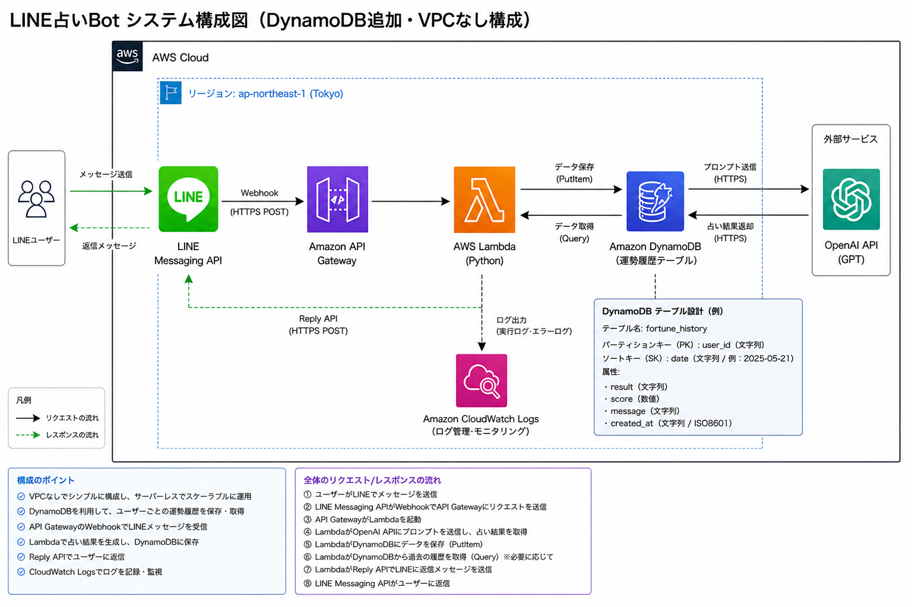

# LINE占いBot（DynamoDB連携）

## 概要
LINEでメッセージを送ると、キャラクターになりきった占い結果を返すBotです。  
ユーザー情報や履歴をDynamoDBに保存し、状態を持ったサービスとして動作します。

---

## 構成図

---

## 使用技術

- LINE Messaging API
- Amazon API Gateway（HTTP API）
- AWS Lambda（Python）
- Amazon DynamoDB
- Amazon CloudWatch Logs

---

## 機能

- メッセージ送信で占い結果を返す
- キャラクター選択（神 / 悪魔 / 未来の自分 など）
- ユーザーIDごとにデータ保存
- DynamoDBに履歴・ユーザー情報を保存

---

## データ設計（DynamoDB）

| PK (Partition Key) | SK (Sort Key) | 内容 |
|------------------|--------------|------|
| userId           | profile      | LINEユーザー名など |
| userId           | history#日時 | 占い履歴 |

※1テーブル設計（シングルテーブルデザイン）

---

## 処理の流れ

1. LINEからWebhookでリクエスト受信  
2. API Gateway経由でLambda起動  
3. ユーザーID取得  
4. DynamoDBからユーザー情報取得 or 保存  
5. 占い結果を生成  
6. LINEにレスポンス返却  

---

## 工夫した実装ポイント

- DynamoDBでシングルテーブル設計を採用し、ユーザー情報と履歴を一元管理
- LINEのプロフィールAPIを利用してユーザー名を取得
- Quick Replyを使ってUXを向上
- Lambdaをステートレスに保ちながら、DynamoDBで状態管理

---

## 学んだこと

- API Gateway → Lambda の連携
- LINE Webhookの仕組み
- DynamoDBのPK / SKの考え方
- サーバレス構成の基本
- ログベースでのトラブルシュート

---

## 今後の改善

- ユーザーごとのキャラクター固定機能
- 占い履歴の参照機能
- UIの改善
- TerraformによるIaC化

---

## 注意点

- APIキーやアクセストークンは含まれていません
- `.env` や `tfvars` はGit管理外にしています

---

## 作者

いちかわ